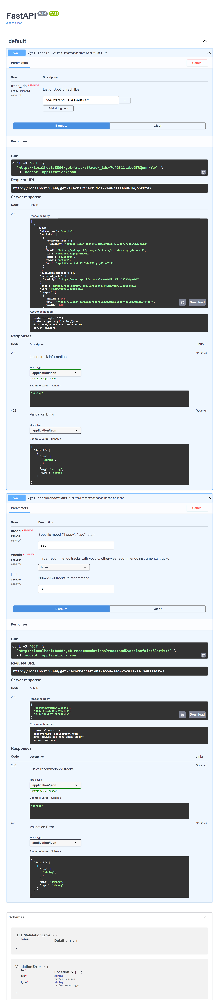

## Installation

:one: Install [Python](https://www.python.org/).

:two: Create and activate Python virtual environment (optional but recommended).

```bash
python3 -m venv env
source env/bin/activate # Linux & MacOS
source env/Scripts/activate # Windows
```

:three: Install backend dependencies

```bash
cd backend/
pip3 install -r requirements.txt
```

## Running the Server

```bash
cd backend/
uvicorn server:app --reload
```

This should start the server running at `http://localhost:8000/`.

To get a recommendation, send a GET request to the `/get-recommendations` endpoint.

```bash
curl http://localhost:8000/get-recommendations?mood=happy
```

## Training the Model

`training.json` holds track IDs under specific tags, indended for training.

Run `train.py` to read the training data in `training.json` and produce `model.json`, which contains generated metadata bounds to be used for recommending tracks.

```bash
cd backend/
python3 train.py
```

## API Documentation



## Running Sentiment Analysis Requirements

*Ensure you are using python 3.7+

1. pip3 install transformers
2. pip3 install tensorflow